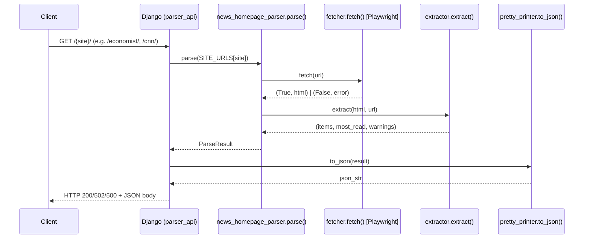

# Design Document: django-api-wrapper

## Overview

将现有 `news_homepage_parser` 包封装为一个可扩展的 Django Web 服务。服务通过统一的 `parser_api` app 暴露多个端点（如 `GET /economist/`、`GET /cnn/`、`GET /ap/` 等），每个端点调用现有 `parse()` 函数抓取并解析对应网站首页，将 `ParseResult` 通过 `to_json()` 序列化后作为 HTTP 响应返回。

设计原则：
- 零侵入：不修改 `news_homepage_parser` 包中任何现有代码
- 可扩展：所有网站解析端点统一放在 `parser_api` app 中，新增网站只需添加视图函数和路由
- 直通：视图层只负责 HTTP 协议转换，业务逻辑完全委托给现有包

## Architecture



### 目录结构

```
project_root/
├── news_homepage_parser/       # 现有包，不修改
├── tests/                      # 现有测试，不修改
├── django_api/                 # 新增：Django 项目包
│   ├── __init__.py
│   ├── settings.py
│   ├── urls.py                 # 根路由，include parser_api.urls
│   └── wsgi.py
├── parser_api/                 # 新增：统一解析 Django app
│   ├── __init__.py
│   ├── views.py                # 每个网站一个视图函数
│   ├── urls.py                 # 按网站名区分路由
│   └── site_config.py         # 网站 URL 映射配置
├── manage.py                   # 新增
└── requirements.txt            # 追加 django
```

新增网站时，只需在 `site_config.py` 添加 URL 映射，在 `views.py` 添加视图函数，在 `urls.py` 添加一条路由。

## Components and Interfaces

### 1. Django 项目配置 (`django_api/`)

- `settings.py`：最小化配置，`INSTALLED_APPS` 包含 `parser_api`，`DATABASES` 使用 SQLite 默认值，`ROOT_URLCONF = 'django_api.urls'`
- `urls.py`：将所有请求通过 `include('parser_api.urls')` 转发到 `parser_api` app

### 2. 网站配置 (`parser_api/site_config.py`)

集中管理各网站的 URL 映射，新增网站只需在此添加一条记录：

```python
SITE_URLS = {
    "economist": "https://www.economist.com",
    "cnn": "https://www.cnn.com",
    "ap": "https://apnews.com",
    # 新增网站：在此添加
}
```

### 3. Parser API App (`parser_api/`)

#### `urls.py` — 路由配置

按网站名区分路由，每个网站对应独立路径：

```python
urlpatterns = [
    path("economist/", views.economist_view),
    path("cnn/", views.cnn_view),
    path("ap/", views.ap_view),
    # 新增网站：在此添加一条路由
]
```

#### `views.py` — 视图函数

每个网站对应一个视图函数，通过共享辅助函数 `_parse_site_view()` 消除重复逻辑：

```python
def _parse_site_view(request, url: str) -> HttpResponse:
    # 仅接受 GET
    # 调用 parse(url)
    # 根据 result.error 决定状态码
    # 返回 HttpResponse(to_json(result), content_type="application/json", status=...)

def economist_view(request):
    return _parse_site_view(request, SITE_URLS["economist"])

def cnn_view(request):
    return _parse_site_view(request, SITE_URLS["cnn"])

# 新增网站：添加对应视图函数，调用 _parse_site_view
```

HTTP 状态码映射：

| 条件 | 状态码 |
|------|--------|
| `result.error` 为 `None` | 200 |
| `result.error` 非空 | 502 |
| `parse()` 抛出未捕获异常 | 500 |
| 非 GET 方法 | 405 |

> 注意：`parse()` 内部已捕获所有异常并将其写入 `result.error`，因此 500 仅作为防御性兜底。

### 4. 现有包接口（只读引用）

| 符号 | 来源 | 用途 |
|------|------|------|
| `parse(url)` | `news_homepage_parser.parser` | 抓取并解析，返回 `ParseResult` |
| `to_json(result)` | `news_homepage_parser.pretty_printer` | 序列化为 JSON 字符串 |
| `ParseResult` | `news_homepage_parser.models` | 类型引用（用于类型注解） |

## Data Models

本服务不引入新的数据模型，完全复用现有模型。

### ParseResult（现有，只读）

```python
@dataclass
class ParseResult:
    url: str
    fetched_at: datetime
    items: list[NewsItem]
    total: int
    most_read: list[NewsItem]
    warnings: list[str]
    error: Optional[str]
```

### JSON 响应结构（由 `to_json()` 生成）

```json
{
  "url": "https://www.economist.com",
  "fetched_at": "2026-03-05T15:23:41.985425+00:00",
  "total": 91,
  "warnings": [],
  "error": null,
  "sections": [
    {
      "section": "Leaders",
      "articles": [
        {
          "title": "A war without strategy",
          "link": "https://www.economist.com/leaders/...",
          "section": "Leaders",
          "_idx": 8
        }
      ]
    }
  ],
  "most_read": [
    {
      "title": "...",
      "link": "https://...",
      "section": "Leaders"
    }
  ]
}
```

### 错误响应结构（502 / 500）

`to_json()` 在 `error` 字段非空时仍正常序列化整个 `ParseResult`，因此错误响应与成功响应结构相同，区别仅在于 `error` 字段有值且 `total` 为 0。


## Correctness Properties

*A property is a characteristic or behavior that should hold true across all valid executions of a system — essentially, a formal statement about what the system should do. Properties serve as the bridge between human-readable specifications and machine-verifiable correctness guarantees.*

### Property 1: HTTP 状态码与 ParseResult.error 一致

*For any* `ParseResult` 对象，当视图函数处理该结果时：若 `error` 为 `None`，响应状态码应为 200；若 `error` 为非空字符串，响应状态码应为 502。

**Validates: Requirements 2.2, 2.3**

### Property 2: 非 GET 方法返回 405

*For any* 非 GET 的 HTTP 方法（POST、PUT、DELETE、PATCH 等），向 `/economist/` 发送请求时，响应状态码应为 405。

**Validates: Requirements 2.5**

### Property 3: API 响应体与 to_json() 输出等价（Round-trip）

*For any* 有效的 `ParseResult` 对象，通过 API 返回的响应体（JSON 字符串）应与直接调用 `to_json(result)` 产生的输出在结构上完全等价。

此属性同时隐含了以下结构性约束（因此 3.1–3.4 不需要单独的属性）：
- 响应包含所有顶层字段：`url`、`fetched_at`、`total`、`sections`、`most_read`、`warnings`、`error`
- `sections` 为数组，每个元素含 `section` 和 `articles` 字段
- 每篇文章含 `title`、`link`、`section` 字段
- `most_read` 中每个元素含 `title`、`link`、`section` 字段

**Validates: Requirements 3.1, 3.2, 3.3, 3.4, 3.5**

### Property 4: Content-Type 始终为 application/json

*For any* 请求（无论成功、502 还是 500），响应头 `Content-Type` 应包含 `application/json`。

**Validates: Requirements 2.2**

## Error Handling

| 场景 | 处理方式 | 状态码 |
|------|----------|--------|
| `parse()` 正常返回，`error=None` | 直接返回 `to_json(result)` | 200 |
| `parse()` 正常返回，`error` 非空 | 直接返回 `to_json(result)`（error 字段已在 JSON 中） | 502 |
| `parse()` 抛出未捕获异常（防御性兜底） | 构造包含 `error` 字段的 JSON 响应 | 500 |
| 非 GET 方法 | Django 内置 `require_GET` 装饰器或手动检查 | 405 |

注意：`parse()` 内部已通过 `try/except` 捕获所有异常并写入 `result.error`，因此 500 路径在正常情况下不会触发，仅作防御性保护。

## Testing Strategy

### 双轨测试方法

本功能采用单元测试 + 属性测试的组合策略：

- **单元测试**：验证具体示例、边界条件和集成点
- **属性测试**：验证跨所有输入的普遍性质

### 单元测试（pytest）

重点覆盖：
- Django URL 路由解析正确（`/economist/` → `economist_view`）
- `news_homepage_parser` 包在 Django 上下文中可正常导入
- `parse()` 抛出异常时返回 500（mock `parse` 抛出异常）
- 非 GET 方法（POST/PUT/DELETE）返回 405

### 属性测试（Hypothesis）

使用 `hypothesis` 库（项目已在 `requirements.txt` 中声明）。

每个属性测试最少运行 100 次迭代（`settings(max_examples=100)`）。

**Property 1 实现思路**：
- 生成随机 `ParseResult`，`error` 字段随机为 `None` 或非空字符串
- mock `parse()` 返回该 `ParseResult`
- 断言状态码 == 200（error=None）或 502（error 非空）
- 标注：`# Feature: django-api-wrapper, Property 1: HTTP status matches ParseResult.error`

**Property 2 实现思路**：
- 生成随机 HTTP 方法字符串（从 POST/PUT/DELETE/PATCH/HEAD/OPTIONS 中采样）
- 发送请求到 `/economist/`
- 断言状态码 == 405
- 标注：`# Feature: django-api-wrapper, Property 2: non-GET methods return 405`

**Property 3 实现思路**：
- 生成随机 `ParseResult`（含随机 `NewsItem` 列表、`most_read`、`warnings`、`error`）
- mock `parse()` 返回该对象
- 调用 `to_json(result)` 得到期望 JSON
- 发送 GET 请求，比较响应体与期望 JSON 的解析结果（`json.loads` 后比较）
- 标注：`# Feature: django-api-wrapper, Property 3: API response equals to_json() output`

**Property 4 实现思路**：
- 生成随机 `ParseResult`（覆盖成功和错误两种情况）
- mock `parse()` 返回该对象
- 断言响应头 `Content-Type` 包含 `application/json`
- 标注：`# Feature: django-api-wrapper, Property 4: Content-Type is always application/json`

### 测试工具

| 工具 | 用途 |
|------|------|
| `pytest` | 测试运行器 |
| `hypothesis` | 属性测试（已在 requirements.txt） |
| `django.test.Client` | Django 测试客户端，无需启动真实服务器 |
| `unittest.mock.patch` | mock `parse()` 函数，隔离网络依赖 |
