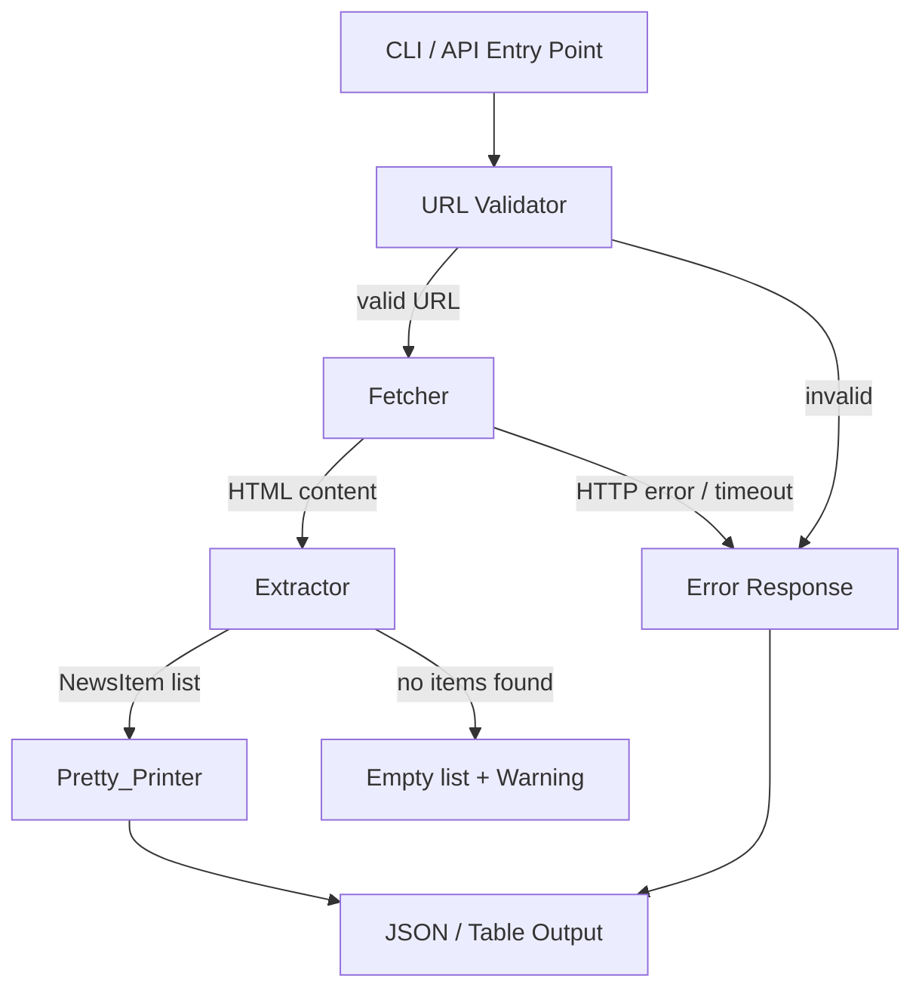

# Design Document: News Homepage Parser

## Overview

News Homepage Parser 是一个命令行工具，接收新闻网站首页 URL，自动抓取 HTML 内容，提取结构化新闻条目（NewsItem），并以 JSON 或表格形式输出结果。

核心流程：

```
URL Input → Validator → Fetcher → Extractor → Pretty_Printer → Output
```

工具采用 Python 实现，依赖 `requests` 进行 HTTP 抓取，`BeautifulSoup` 进行 HTML 解析，`rich` 进行表格格式化输出。

---

## Architecture



各组件职责单一，通过明确的数据结构传递数据，便于独立测试和替换具体实现（如替换 HTTP 客户端或 HTML 解析库）。

---

## Components and Interfaces

### 1. URL Validator

```python
def validate_url(url: str) -> Result[str, str]:
    """
    验证 URL 合法性。
    返回 Ok(url) 或 Err(error_message)。
    """
```

职责：
- 检查 URL 非空
- 检查 scheme 为 http 或 https
- 检查 URL 格式合法（可被 urllib.parse 解析）

### 2. Fetcher

```python
def fetch(url: str, timeout: int = 15) -> Result[str, str]:
    """
    发起 HTTP GET 请求，返回 HTML 字符串或错误信息。
    自动附加 User-Agent header。
    """
```

职责：
- 发送 GET 请求，携带 User-Agent
- 检查 HTTP 状态码（非 200 返回错误）
- 处理超时（15 秒）和网络异常

### 3. Extractor

```python
def extract(html: str, base_url: str) -> tuple[list[NewsItem], list[str]]:
    """
    从 HTML 中提取 NewsItem 列表。
    返回 (items, warnings)，warnings 包含提示信息（如使用了通用策略）。
    """
```

内部策略选择：
- 根据 base_url 的域名匹配已知网站策略（Economist、BBC、CNN）
- 无匹配时降级为通用策略（`<article>`、`<h2>`、`<a>` 标签）

### 4. Pretty_Printer

```python
def to_json(result: ParseResult) -> str:
    """序列化为 JSON 字符串"""

def to_table(result: ParseResult) -> str:
    """渲染为格式化表格"""

def from_json(json_str: str) -> Result[list[NewsItem], str]:
    """从 JSON 字符串反序列化"""
```

### 5. Parser（顶层协调器）

```python
def parse(url: str, output_format: str = "json") -> ParseResult:
    """
    顶层入口：验证 → 抓取 → 提取 → 格式化。
    捕获所有未处理异常，返回结构化错误响应。
    """
```

---

## Data Models

```python
from dataclasses import dataclass, field
from typing import Optional
from datetime import datetime

@dataclass
class NewsItem:
    title: str                    # 新闻标题，非空字符串
    link: str                     # 绝对 URL
    section: Optional[str] = None # 栏目名称，无则为 None

@dataclass
class ParseResult:
    url: str                              # 来源 URL
    fetched_at: datetime                  # 抓取时间戳
    items: list[NewsItem] = field(default_factory=list)
    total: int = 0                        # 等于 len(items)
    warnings: list[str] = field(default_factory=list)
    error: Optional[str] = None           # 顶层错误信息（如有）
```

JSON 序列化格式示例：

```json
{
  "url": "https://www.bbc.com",
  "fetched_at": "2024-01-15T10:30:00Z",
  "total": 42,
  "warnings": [],
  "items": [
    {
      "title": "Example News Title",
      "link": "https://www.bbc.com/news/example",
      "section": "World"
    }
  ]
}
```

`NewsItem.section` 为 `null` 时在 JSON 中序列化为 `null`（而非省略该字段），保证 round-trip 一致性。

---

## Correctness Properties

*A property is a characteristic or behavior that should hold true across all valid executions of a system — essentially, a formal statement about what the system should do. Properties serve as the bridge between human-readable specifications and machine-verifiable correctness guarantees.*

### Property 1: Invalid URL validation

*For any* URL string that is not a valid `http` or `https` URL (including empty strings, non-http/https schemes, and malformed strings), `validate_url` should return an error result.

**Validates: Requirements 1.3, 1.4, 1.5**

---

### Property 2: Non-200 HTTP status returns error containing status code

*For any* HTTP response with a status code other than 200, the Fetcher should return an error message that contains the actual status code value.

**Validates: Requirements 2.3**

---

### Property 3: All extracted NewsItems have non-empty title and absolute URL link

*For any* HTML content and base URL, every NewsItem in the extracted list should have a non-empty title string and a link that is an absolute URL (starts with `http://` or `https://`).

**Validates: Requirements 3.2, 3.3**

---

### Property 4: Relative URLs are resolved to absolute

*For any* HTML page containing relative links and a given base URL, after extraction all NewsItem links should be absolute URLs derived from the base URL.

**Validates: Requirements 3.6**

---

### Property 5: Table output contains all required columns and item data

*For any* non-empty list of NewsItems, the table-format output should contain the column headers "title", "link", and "section", and should contain each item's title and link text.

**Validates: Requirements 4.2**

---

### Property 6: ParseResult round-trip serialization

*For any* valid `ParseResult` (including its `url`, `fetched_at`, `total`, and `items` fields), serializing to JSON and then deserializing should produce a `ParseResult` equivalent to the original.

**Validates: Requirements 4.3, 4.4, 5.1, 5.2, 5.3**

---

### Property 7: Generic extraction strategy notice in warnings

*For any* HTML content that does not match any known site-specific extraction strategy, the extraction result's warnings list should contain at least one notice indicating that generic extraction was applied.

**Validates: Requirements 6.4**

---

## Error Handling

| 场景 | 组件 | 返回形式 |
|------|------|----------|
| URL 为空 | Validator | `Err("URL is required")` |
| URL scheme 非 http/https | Validator | `Err("Invalid URL scheme: <scheme>")` |
| URL 格式非法 | Validator | `Err("Invalid URL format")` |
| HTTP 状态码非 200 | Fetcher | `Err("HTTP error: <status_code>")` |
| 请求超时（>15s） | Fetcher | `Err("Request timed out after 15 seconds")` |
| 网络错误 | Fetcher | `Err("Network error: <message>")` |
| 无法识别新闻条目 | Extractor | `([], ["Warning: no news items found"])` |
| JSON 反序列化失败 | Pretty_Printer | `Err("Deserialization failed: <message>")` |
| 未捕获异常 | Parser | `ParseResult(error="<type>: <message>")` |

所有错误均通过 `ParseResult.error` 字段或 `Result[T, str]` 返回类型向上传递，不抛出未处理异常。顶层 `parse()` 函数使用 `try/except Exception` 兜底，确保始终返回结构化响应。

日志记录使用 Python 标准库 `logging` 模块，错误级别为 `ERROR`，包含异常类型、消息和堆栈信息。

---

## Testing Strategy

### 双重测试方法

同时使用单元测试和基于属性的测试（Property-Based Testing），两者互补：

- **单元测试**：验证具体示例、边界条件和错误场景
- **属性测试**：通过随机输入验证普遍性质，覆盖大量输入组合

### 属性测试库

使用 [Hypothesis](https://hypothesis.readthedocs.io/)（Python PBT 库），每个属性测试配置最少 100 次迭代：

```python
from hypothesis import given, settings
from hypothesis import strategies as st

@settings(max_examples=100)
@given(...)
def test_property_N(...):
    ...
```

每个属性测试必须通过注释标注对应的设计属性：

```python
# Feature: news-homepage-parser, Property N: <property_text>
```

### 属性测试列表

| 属性 | 测试描述 | 对应设计属性 |
|------|----------|-------------|
| P1 | 生成非 http/https URL 字符串，验证 validate_url 返回错误 | Property 1 |
| P2 | 生成非 200 状态码，mock HTTP 响应，验证错误消息含状态码 | Property 2 |
| P3 | 生成随机 HTML 结构，验证所有提取的 NewsItem 标题非空且链接为绝对 URL | Property 3 |
| P4 | 生成含相对链接的 HTML，验证提取后所有链接为绝对 URL | Property 4 |
| P5 | 生成随机 NewsItem 列表，验证表格输出含必要列头和数据 | Property 5 |
| P6 | 生成随机 ParseResult，序列化后反序列化，验证等价 | Property 6 |
| P7 | 生成不匹配任何已知站点的 HTML，验证 warnings 含通用策略提示 | Property 7 |

### 单元测试列表

- URL 为空时返回错误（Requirements 1.3）
- HTTP 200 时正常返回 HTML（Requirements 2.2）
- HTTP 超时时返回超时错误（Requirements 2.4）
- 网络错误时返回网络错误（Requirements 2.5）
- 请求携带 User-Agent header（Requirements 2.6）
- 含 section 标签的 HTML 正确提取 section（Requirements 3.4, 3.5）
- 无新闻条目时返回空列表和警告（Requirements 3.7）
- JSON 输出包含 total、url、fetched_at 字段（Requirements 4.3, 4.4）
- 恶意 JSON 字符串反序列化返回错误（Requirements 5.4）
- BBC/CNN/Economist 各站点示例 HTML 提取正确（Requirements 6.1, 6.2）
- 未知站点触发通用策略（Requirements 6.3）
- 组件抛出异常时顶层返回结构化错误（Requirements 7.1）

### 测试文件结构

```
tests/
  test_validator.py       # URL 验证单元测试 + P1 属性测试
  test_fetcher.py         # Fetcher 单元测试 + P2 属性测试
  test_extractor.py       # Extractor 单元测试 + P3/P4/P7 属性测试
  test_pretty_printer.py  # Pretty_Printer 单元测试 + P5/P6 属性测试
  test_integration.py     # 端到端集成测试（mock HTTP）
```
