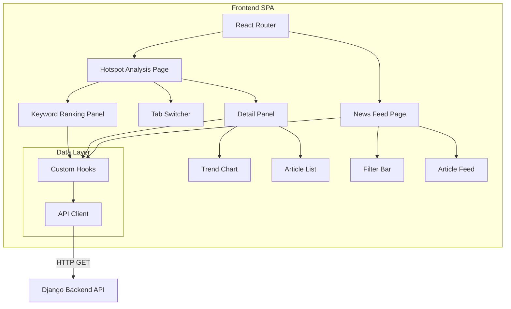

# Design Document: News Hotspot Frontend

## Overview

The News Hotspot Frontend is a React + TypeScript single-page application that provides a visual interface for exploring news hotspot keywords and their associated articles. It consumes data from the existing Django news aggregation backend via REST API endpoints.

The application has two primary views:
1. **Hotspot Analysis Page** — A split-panel layout with keyword rankings on the left and trend/article details on the right
2. **News Feed Page** — A chronological article browser with platform and section filters

The frontend is a standalone SPA that communicates with the Django backend over HTTP. It uses React Router for client-side navigation, a charting library for trend visualization, and a component-based architecture with custom hooks for data fetching and state management.

## Architecture



### Technology Stack

| Layer | Choice | Rationale |
|-------|--------|-----------|
| Framework | React 18 + TypeScript | Type safety, component model, ecosystem |
| Build Tool | Vite | Fast dev server, optimized builds |
| Routing | React Router v6 | Standard SPA routing |
| Charting | Recharts | React-native charts, responsive, lightweight |
| HTTP Client | fetch + custom wrapper | No extra dependency, AbortController for timeouts |
| Styling | CSS Modules or Tailwind CSS | Scoped styles, utility-first option |
| State Management | React hooks (useState, useReducer) | Sufficient for this scope, no global store needed |
| Testing | Vitest + React Testing Library + fast-check | Fast, TypeScript-native, property-based testing |

### API Endpoints (Backend)

The frontend requires the following API endpoints. Some already exist; others need to be added to the Django backend:

| Endpoint | Status | Description |
|----------|--------|-------------|
| `GET /api/keywords/?group={domestic\|international}` | Exists | Returns latest keyword analysis with rankings |
| `GET /api/keywords/llm/?group={domestic\|international}` | Exists | Returns LLM-based keyword analysis |
| `GET /api/keywords/ranking/?group={group}` | **New** | Returns keyword rankings with trend direction |
| `GET /api/keywords/trend/?keyword={kw}&group={group}&days=7` | **New** | Returns historical scores for a keyword |
| `GET /api/keywords/articles/?keyword={kw}&group={group}` | **New** | Returns articles associated with a keyword |
| `GET /api/news/feed/?platform={p}&section={s}&page={n}` | **New** | Paginated article feed with filters |
| `GET /api/platforms/` | **New** | Platform metadata (last fetch, article count) |

**Design Decision:** The existing `/api/keywords/` endpoint returns full keyword data including `sample_articles`. For the frontend, we'll design new endpoints that are optimized for the UI's needs (separate ranking, trend, and article endpoints). However, as a pragmatic first step, the frontend can derive ranking and article data from the existing endpoint response, and new endpoints can be added incrementally.

## Components and Interfaces

### Component Hierarchy

```
App
├── NavBar
├── HotspotPage
│   ├── TabSwitcher
│   ├── KeywordRankingPanel
│   │   ├── KeywordItem (×N)
│   │   └── LoadingSkeleton / ErrorState
│   └── DetailPanel
│       ├── TrendChart
│       ├── ArticleList
│       │   └── PlatformGroup (×N)
│       │       └── ArticleItem (×N)
│       └── EmptyState / LoadingState
└── NewsFeedPage
    ├── FilterBar
    │   ├── PlatformFilter
    │   └── SectionFilter
    ├── ArticleFeedList
    │   └── FeedArticleItem (×N)
    ├── Pagination
    └── LoadingState
```

### Key Interfaces (TypeScript)

```typescript
// === API Response Types ===

interface KeywordRankingResponse {
  analysis_time: string;
  group: string;
  keywords: KeywordData[];
}

interface KeywordData {
  keyword: string;
  score: number;
  rank: number;
  count: number;
  platform_count: number;
  coverage: number;
  sources: string[];
  sample_articles: ArticleSummary[];
  trend_direction?: 'rising' | 'falling' | 'stable';
}

interface ArticleSummary {
  title: string;
  url: string;
  platform: string;
}

interface TrendDataPoint {
  timestamp: string;  // ISO 8601
  score: number;
}

interface TrendResponse {
  keyword: string;
  data_points: TrendDataPoint[];
}

interface ArticleDetail {
  id: number;
  title: string;
  url: string;
  platform: string;
  section: string;
  date: string;  // ISO 8601
}

interface ArticlesResponse {
  keyword: string;
  articles: ArticleDetail[];
}

interface PlatformMetadata {
  name: string;
  label: string;
  group: 'domestic' | 'international';
  last_fetch: string;  // ISO 8601
  article_count: number;
}

interface NewsFeedResponse {
  articles: ArticleDetail[];
  total: number;
  page: number;
  page_size: number;
  has_next: boolean;
}

// === Component Props ===

interface KeywordItemProps {
  data: KeywordData;
  isSelected: boolean;
  onClick: (keyword: string) => void;
}

interface TrendChartProps {
  data: TrendDataPoint[];
  keyword: string;
}

interface ArticleListProps {
  articles: ArticleDetail[];
}

interface FilterBarProps {
  platforms: string[];
  sections: string[];
  selectedPlatforms: string[];
  selectedSection: string | null;
  onPlatformChange: (platforms: string[]) => void;
  onSectionChange: (section: string | null) => void;
}
```

### Custom Hooks

```typescript
// Data fetching hooks
function useKeywordRanking(group: 'domestic' | 'international'): {
  data: KeywordData[] | null;
  loading: boolean;
  error: string | null;
  retry: () => void;
}

function useKeywordTrend(keyword: string | null, group: string): {
  data: TrendDataPoint[] | null;
  loading: boolean;
  error: string | null;
}

function useKeywordArticles(keyword: string | null, group: string): {
  data: ArticleDetail[] | null;
  loading: boolean;
  error: string | null;
}

function useNewsFeed(filters: FeedFilters, page: number): {
  data: NewsFeedResponse | null;
  loading: boolean;
  error: string | null;
}

function usePlatforms(): {
  data: PlatformMetadata[] | null;
  loading: boolean;
  error: string | null;
}
```

### API Client

```typescript
// Centralized API client with timeout, error handling, and base URL config
class ApiClient {
  private baseUrl: string;
  private timeout: number; // 10000ms

  constructor(baseUrl?: string) {
    this.baseUrl = baseUrl || import.meta.env.VITE_API_BASE_URL || '/api';
    this.timeout = 10000;
  }

  async get<T>(path: string, params?: Record<string, string>): Promise<T> {
    const controller = new AbortController();
    const timeoutId = setTimeout(() => controller.abort(), this.timeout);
    
    try {
      const url = new URL(path, this.baseUrl);
      if (params) {
        Object.entries(params).forEach(([k, v]) => url.searchParams.set(k, v));
      }
      
      const response = await fetch(url.toString(), { signal: controller.signal });
      
      if (!response.ok) {
        throw new ApiError(response.status, await response.text());
      }
      
      return await response.json();
    } finally {
      clearTimeout(timeoutId);
    }
  }
}
```

## Data Models

### Frontend State Model

```typescript
interface AppState {
  // Tab state
  activeGroup: 'domestic' | 'international';
  
  // Keyword selection
  selectedKeyword: string | null;
  
  // Current page
  currentPage: 'hotspot' | 'feed';
}
```

### Data Transformation Functions

The frontend needs several pure transformation functions:

1. **`sortKeywordsByRank(keywords: KeywordData[]): KeywordData[]`** — Sorts keywords by rank ascending
2. **`computeTrendDirection(current: number, previous: number): 'rising' | 'falling' | 'stable'`** — Determines trend direction from two scores
3. **`groupArticlesByPlatform(articles: ArticleDetail[]): PlatformArticleGroup[]`** — Groups articles by platform, sorted by group size descending
4. **`isStale(timestamp: string, thresholdHours: number): boolean`** — Checks if a timestamp is older than threshold
5. **`mapHttpErrorToMessage(status: number): string`** — Maps HTTP status codes to user-friendly Chinese messages
6. **`formatScore(score: number): string`** — Formats score for display
7. **`formatCoverage(coverage: number): string`** — Formats coverage as percentage

```typescript
interface PlatformArticleGroup {
  platform: string;
  articles: ArticleDetail[];
  count: number;
}

function groupArticlesByPlatform(articles: ArticleDetail[]): PlatformArticleGroup[] {
  // Group by platform
  const groups = new Map<string, ArticleDetail[]>();
  for (const article of articles) {
    const list = groups.get(article.platform) || [];
    list.push(article);
    groups.set(article.platform, list);
  }
  // Convert to array and sort by count descending
  return Array.from(groups.entries())
    .map(([platform, articles]) => ({ platform, articles, count: articles.length }))
    .sort((a, b) => b.count - a.count);
}

function computeTrendDirection(current: number, previous: number): 'rising' | 'falling' | 'stable' {
  if (current > previous) return 'rising';
  if (current < previous) return 'falling';
  return 'stable';
}

function isStale(timestamp: string, thresholdHours: number = 2): boolean {
  const fetchTime = new Date(timestamp).getTime();
  const now = Date.now();
  return (now - fetchTime) > thresholdHours * 60 * 60 * 1000;
}

function mapHttpErrorToMessage(status: number): string {
  if (status === 404) return '数据未找到，请稍后重试';
  if (status === 408 || status === 504) return '请求超时，请检查网络连接';
  if (status >= 500) return '服务器错误，请稍后重试';
  if (status >= 400) return '请求错误，请刷新页面';
  return '未知错误';
}
```

## Correctness Properties

*A property is a characteristic or behavior that should hold true across all valid executions of a system — essentially, a formal statement about what the system should do. Properties serve as the bridge between human-readable specifications and machine-verifiable correctness guarantees.*

### Property 1: Keyword data rendering completeness

*For any* valid keyword data object containing rank, keyword text, score, and coverage fields, the rendering function SHALL produce output that includes all four fields.

**Validates: Requirements 1.2**

### Property 2: Keyword list sorting invariant

*For any* array of keyword data objects with arbitrary rank values, the sort function SHALL produce an array where each element's rank is less than or equal to the next element's rank.

**Validates: Requirements 1.3**

### Property 3: Trend direction computation correctness

*For any* pair of numeric scores (current, previous), the trend direction function SHALL return 'rising' when current > previous, 'falling' when current < previous, and 'stable' when current equals previous.

**Validates: Requirements 1.4**

### Property 4: Tab switch resets selection state

*For any* application state where a keyword is selected, switching the active tab SHALL result in the selected keyword being null and the detail panel data being cleared.

**Validates: Requirements 2.5**

### Property 5: Keyword selection triggers correct data fetches

*For any* keyword string and group, selecting that keyword SHALL trigger API calls to both the trend endpoint and the articles endpoint with the correct keyword and group parameters.

**Validates: Requirements 3.2, 3.3**

### Property 6: Article grouping correctness

*For any* list of articles with various platform values, the grouping function SHALL produce groups where each group's platform matches all articles within it, and each group header count equals the number of articles in that group.

**Validates: Requirements 5.1, 5.4**

### Property 7: Platform group ordering invariant

*For any* list of articles, after grouping by platform, the resulting groups SHALL be ordered by article count in descending order (each group's count is greater than or equal to the next group's count).

**Validates: Requirements 5.5**

### Property 8: News feed chronological ordering

*For any* list of articles with timestamps, the display order SHALL be reverse chronological (each article's timestamp is greater than or equal to the next article's timestamp).

**Validates: Requirements 7.1**

### Property 9: Filter-to-API parameter mapping

*For any* combination of platform filter selections and section filter selection, the API call SHALL include query parameters that exactly match the selected filter values.

**Validates: Requirements 7.4**

### Property 10: HTTP error message mapping completeness

*For any* HTTP error status code (400–599), the error mapping function SHALL return a non-empty, user-friendly message string (not the raw status code).

**Validates: Requirements 9.1**

### Property 11: Empty dataset produces empty-state message

*For any* API response that contains an empty data array, the corresponding component SHALL render an empty-state message element rather than rendering nothing.

**Validates: Requirements 9.5**

### Property 12: Platform staleness detection

*For any* timestamp string, the staleness function SHALL return true if and only if the timestamp is more than 2 hours in the past relative to the current time.

**Validates: Requirements 10.3**

## Error Handling

### Error Categories and User Messages

| Error Type | Detection | User Message | Recovery |
|-----------|-----------|--------------|----------|
| Network timeout | AbortController after 10s | "请求超时，请检查网络连接" | Retry button |
| HTTP 4xx | Response status check | "请求错误，请刷新页面" | Retry button |
| HTTP 5xx | Response status check | "服务器错误，请稍后重试" | Retry button |
| Empty data | Empty array in response | Context-specific empty state | None needed |
| Parse error | JSON.parse failure | "数据格式错误" | Retry button |

### Error Boundary Strategy

- A top-level React Error Boundary catches unhandled rendering errors and displays a fallback UI
- Each data-fetching hook manages its own loading/error/data states
- Components display inline error states with retry buttons rather than full-page errors
- The API client throws typed `ApiError` objects that components can inspect

### Retry Mechanism

```typescript
// Each hook exposes a retry() function that re-triggers the fetch
// Retry is manual (user-initiated via button click), not automatic
// This avoids hammering a failing backend
```

## Testing Strategy

### Unit Tests (Vitest + React Testing Library)

Unit tests cover:
- Component rendering in various states (loading, error, data, empty)
- User interactions (tab switching, keyword selection, filter changes)
- API client behavior (timeout, error handling)
- Router navigation

### Property-Based Tests (fast-check + Vitest)

Property-based tests validate the correctness properties defined above. They focus on the pure transformation functions and state logic:

- **Library:** fast-check (TypeScript-native PBT library)
- **Minimum iterations:** 100 per property
- **Tag format:** `Feature: news-hotspot-frontend, Property {N}: {title}`

Target functions for PBT:
1. `sortKeywordsByRank` — sorting invariant
2. `computeTrendDirection` — exhaustive direction logic
3. `groupArticlesByPlatform` — grouping correctness and ordering
4. `isStale` — timestamp comparison
5. `mapHttpErrorToMessage` — error code mapping
6. State reducer logic for tab switching and keyword selection

### Integration Tests

Integration tests verify:
- API client correctly calls backend endpoints with proper parameters
- Components correctly wire hooks to UI elements
- Router transitions preserve state appropriately

### Test File Structure

```
src/
├── utils/
│   ├── transformations.ts          # Pure functions
│   └── transformations.test.ts     # Property tests for pure functions
├── hooks/
│   ├── useKeywordRanking.ts
│   └── useKeywordRanking.test.ts   # Hook behavior tests
├── components/
│   ├── KeywordRankingPanel/
│   │   ├── index.tsx
│   │   └── KeywordRankingPanel.test.tsx
│   └── ...
└── api/
    ├── client.ts
    └── client.test.ts              # API client tests
```
